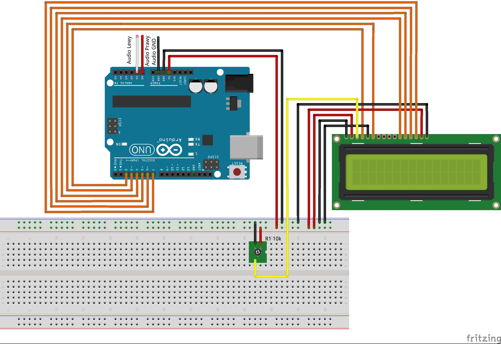

# Projekt wizualizera dźwięku
Układ ma za zadanie wyświetlać na ekranie LCD wskaźnik sygnału dźwięku w opraciu o transformatę fouriera.
# Potrzebne elementy
- płytka Arduino Uno
- płytka stykowa
- ekran LCD 16x2
- potencjometr 10k
- kable
# Schemat

# Zdjęcie przedstawiające wykonany projekt

# Film przedstawiający wykonany projekt
[](http://www.youtube.com/watch?v=jLMTDOeTb-E "Wizualizer dźwięku test")
# Kod
```cpp
#include <LiquidCrystal.h>//Obsługa wyświetlacza
#include <fix_fft.h>//Obsługa transforamty fouriera

LiquidCrystal lcd(2, 3, 4, 5, 6, 7); //Informacja o podłączeniu wyświetlacza
 
#define L_IN 1//Wejście lewego kanału A1
#define R_IN 0//Wejście prawego kanału A0

const int Yres = 8;//Górny zakres
const int gain = 3;//Czułość
float peaks[64];//tablica przechowująca wartość do wyświetlenia
char Lim[64], Ldata[64];//Lewy kanał
char Rim[64], Rdata[64];//Prawy kanał
char data_avgs[64];//Średnia wartość wyliczeń
int i;//do pętli

//znaki słupków
byte v1[8] = {
  B00000, B00000, B00000, B00000, B00000, B00000, B00000, B11111
};
byte v2[8] = {
  B00000, B00000, B00000, B00000, B00000, B00000, B00000, B11111
};
byte v3[8] = {
  B00000, B00000, B00000, B00000, B00000, B11111, B11111, B11111
};
byte v4[8] = {
  B00000, B00000, B00000, B00000, B11111, B11111, B11111, B11111
};
byte v5[8] = {
  B00000, B00000, B00000, B11111, B11111, B11111, B11111, B11111
};
byte v6[8] = {
  B00000, B00000, B11111, B11111, B11111, B11111, B11111, B11111
};
byte v7[8] = {
  B00000, B11111, B11111, B11111, B11111, B11111, B11111, B11111
};
byte v8[8] = {
  B11111, B11111, B11111, B11111, B11111, B11111, B11111, B11111
};

void setup(){
  lcd.begin(16, 2);
  lcd.clear();
 //deklaracja słupków
  lcd.createChar(1, v1);
  lcd.createChar(2, v2);
  lcd.createChar(3, v3);
  lcd.createChar(4, v4);
  lcd.createChar(5, v5);
  lcd.createChar(6, v6);
  lcd.createChar(7, v7);
  lcd.createChar(8, v8);

//animacja wczytywania, totalnie zbędna, ale super wygląda
  int load;
  lcd.setCursor(0, 0);
  lcd.print("WCZYTYWANIE.....");
  
  for (i=0;i<128;i++){
    for (load = 0; load <= i / 8; load++){
      lcd.setCursor(load, 1);
    }
    if (load < 1){
      lcd.setCursor(0, 0);
    }
    lcd.write((i - i / 8 * 8) + 1);
    delay(5);
  }
  lcd.clear();
}

void loop(){

  for (int i = 0; i < 64; i++){ //64 biny to 32 biny używalnego zakresu
    Ldata[i]  = ((analogRead(L_IN) / 4 ) - 128);//Interpretacja danych z wejścia analogowego
    Lim[i]  = 0;//Część urojona
    Rdata[i] = ((analogRead(R_IN) / 4 ) - 128);
    Rim[i] = 0;
  }

//Liczenie FFT
  fix_fft(Ldata, Lim, 6, 0);
  fix_fft(Rdata, Rim, 6, 0);

//Biny z zakresu 32-63 są zduplikowane

//Obliczanie wartości bezwględnej
  for (int i = 0; i < 32; i++){
    Ldata[i] = sqrt(Ldata[i]  *  Ldata[i] +  Lim[i] *  Lim[i]);
    Rdata[i] = sqrt(Rdata[i] * Rdata[i] + Rim[i] * Rim[i]);

//Kopiowanie wszystkiego do jednej tablicy by ułatwić wyświetlanie
    if (i < 16){
      data_avgs[i] = Ldata[i];
    }else{
      data_avgs[i] = Rdata[i - 16];
    }

//Przypisanie wartości do konkretnych kontenerów w wyświetlaczu
    data_avgs[i] = constrain(data_avgs[i], 0, 9 - gain);
    data_avgs[i] = map(data_avgs[i], 0, 9 - gain, 0, Yres);
  }

  LCD();//Wyświetlenie wyników
  decay();//Animacja opadania słupka
}

void LCD(){
//Wyświetlenie oznaczenia kanału
  lcd.setCursor(0, 0);
  lcd.print("L");
  lcd.setCursor(0, 1);
  lcd.print("P");


  for (int x = 1; x < 16; x++){
    int y = x + 16;

//jeśli nowa wartości jest większa od starej
    if (data_avgs[x] > peaks[x]){
      peaks[x] = data_avgs[x];
    }
//To jest ona przypisywana
    if (data_avgs[y] > peaks[y]){
      peaks[y] = data_avgs[y];
    }


    lcd.setCursor(x, 0);//Górna linia
    if (peaks[x] != 0){//jeśli wartość jest inna niż 0
      lcd.write(peaks[x]);//To ją wyświetl
    }

    lcd.setCursor(x, 1);//Dolna linia
    if (peaks[y] != 0){
      lcd.write(peaks[y]);
    }
  }
}

void decay(){
  //Animacja opadania słupka
  for (int x = 0; x <= 32; x++){
    peaks[x] = peaks[x] - 1;//-1 od ostatniej nowej wartości
  }
}
```
# Linki
[Biblioteka do FFT](https://www.arduino.cc/reference/en/libraries/fix_fft/)