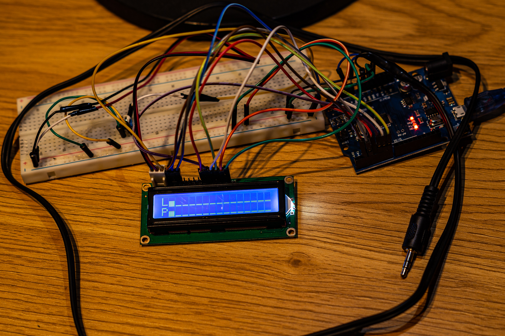

# Projekt wizualizera dźwięku
Układ ma za zadanie wyświetlać na ekranie LCD wizualizację dźwięku w opraciu o analizę furiera.
# Potrzebne elementy
- płytka Arduino Uno
- płytka stykowa
- ekran LCD 16x2
- czujnik dźwięku
- kable
# Schemat
//to do
# Zdjęcie przedstawiające wykonany projekt

# Film przedstawiający wykonany projekt

# Kod
//to do
